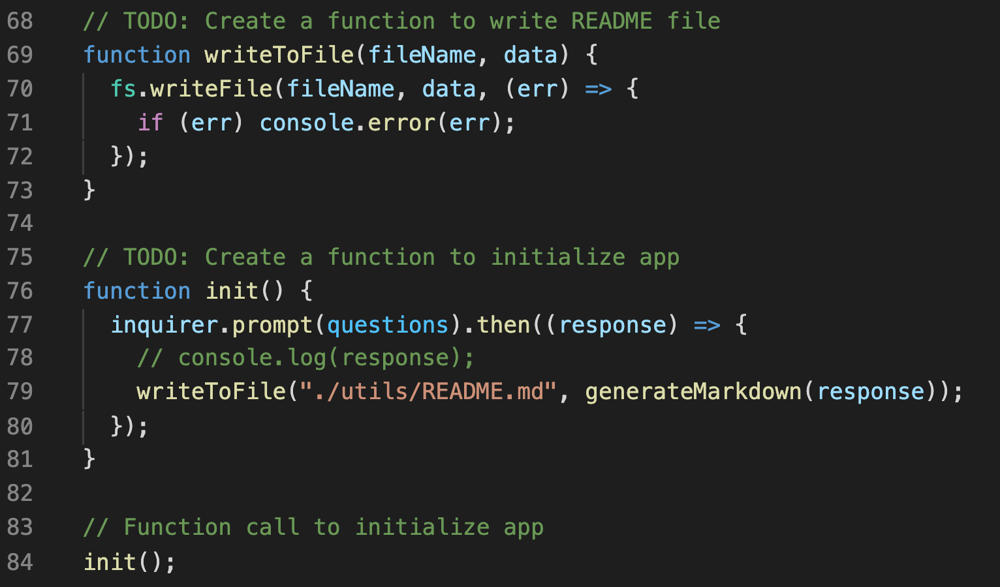
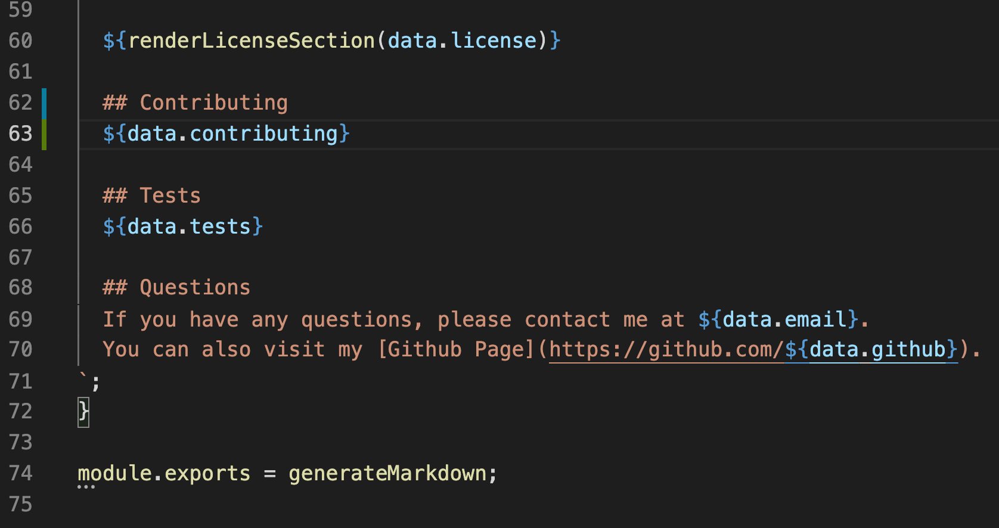
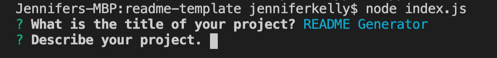

# README Generator

# Description

README Template that allows User to answer questions in the command line which will generate their README.

# Table of Contents

- [Installation](#installation)
- [Usage](#usage)
- [Contributing](#contributing)
- [Questions](#questions)
- [Tests](#tests)
- [License](#license)

## Installation

User must first install Node.js. Type node index.js in the command line to begin.

## Usage

When User needs to create a README for a project, they can use this simple guideline to easily set one up. In order to run, simply open an Integrated Terminal and run 'node index.js'

## Demo

View working Demo: [Demo](https://drive.google.com/file/d/1Uz_5fFRbcoJU_8Kk8MBWqb6BNUC-5uvh/view?usp=sharing)

## License

- https://choosealicense.com/licenses/mit/

  ## Questions

  If you have any questions, please contact me at jenLkelly@gmail.com.  
  You can also visit my [Github Page](https://github.com/jkelly101).
